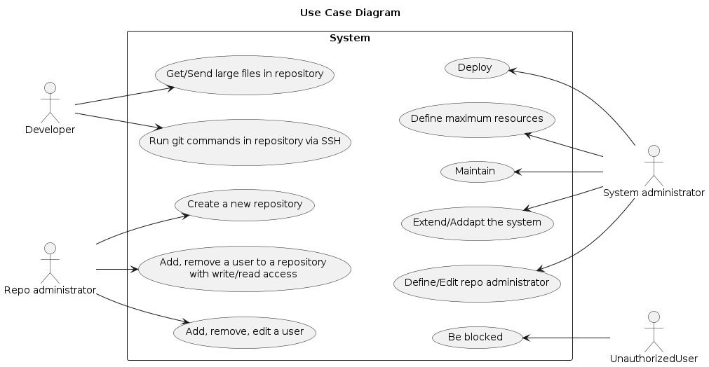

# Use cases

In normal use, three types of actors can interact with the system:

-  **Developers** are the people that use the system to store and retrieve files. They are authenticated and authorized by the system.
-  **Repo administrator** is the people or external system who defines the repositories and the authorizations
-  **System administrator** is someone managing the system and its resources. He is owner of the system and defines the system configuration. He maintains and deploy the system.

Additionally, any non authenticated user is considered harmful and all interactions must be rejected.

The next figure shows the use cases of these actors of the system. 

