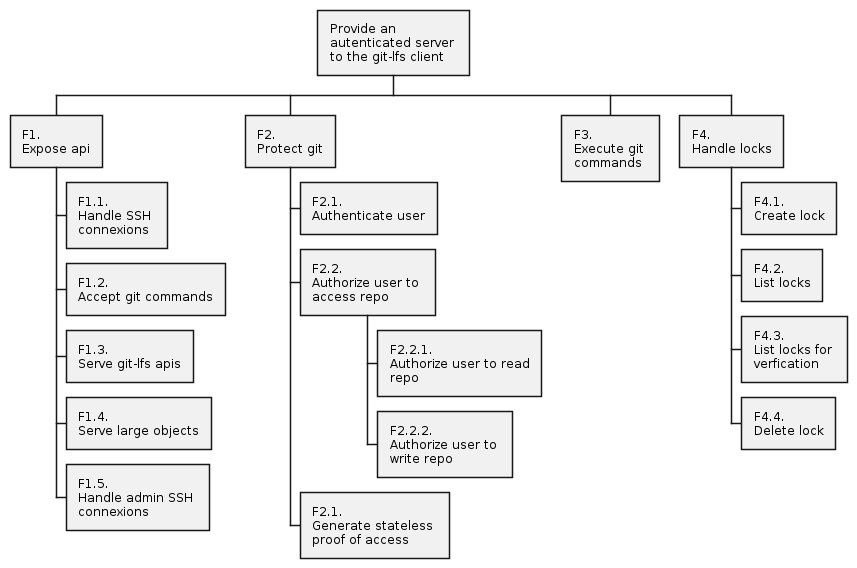
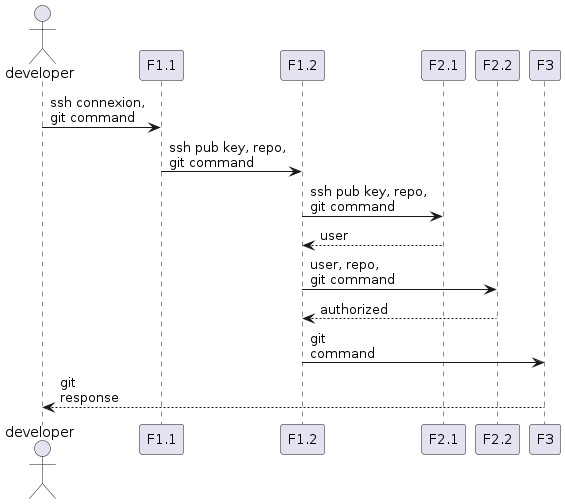
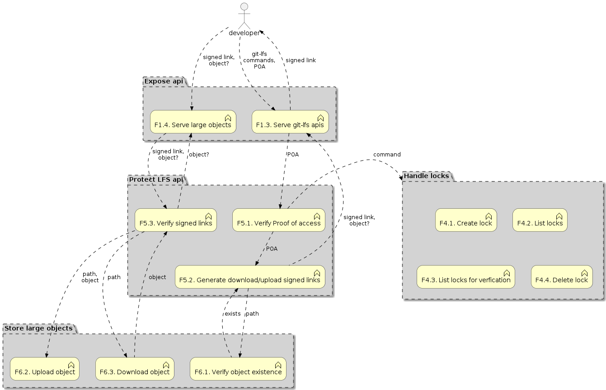

# Functions

## Functions identification

In a first approach, we can identify seven main functions:

- **Expose api**: the system will expose a public api and prevent access to any private api.
- **Protect git**: the system will authenticate and authorize users to perform git or git-lfs commands.
- **Execute git commands**: the system will execute git commands on behalf of the user, and actually store the repositories in a centralized way.
- **Handle locks**: the system will provide the locking mechanism defined by git-lfs.
- **Protect LFS api**: the system will manage git-lfs requests, mainly verifying that user can upload/download objects
- **Store large objects**: the system will store and retrieve the objects
- **Manage repositories and users**: the system will provide interfaces and mechanisms to manage repositories and users
- **Manage the system**: access the system infrastructure, logs, backups, etc.

## Break down

If we break down these functions one level down, we can identify the sub-functions described by following figures.

## Detailed interactions

As a (too complex) overview, the functions interact with each other as shown in next figure. To break down the complexity, let's consider a few projections of this model.

## Interactions of first level functions

At first level, the developer run git commands and get responses. Down, either we go to the git protection functions, and the git functions, or we go to the git-lfs related functions. This separation satisfies R10, as only the stateless proof of access (POA) is shared. User request one to the "git-related" functions, and use it into the "git-lfs" functions. The data flows are shown in next figure.

To explore down the possible interactions, we will use sequence diagrams. 

## Simple git commands

When developer run regular git commands, (no lfs), his SSH connexion must be handled, and then we are ready to accept git commands. But before running them, we shall ensure the uses is allowed to perform them, using the function F2. Then, the git command can be executed and the result be returned to the user via the SSH channel. The whole interaction is shown in following figures.

## Get a proof of access

When developer run lfs git commands, he first need to get authenticated. As the lfs functions are unable to access the authorization state of the user, he first need to acquire a proof that he can perform an LFS action. So user first connect through SSH to the authentication server, get a proof of access, and then can use it. The POA acquisition flow is shown in next figure.

The client can use the git-lfs-authenticate to get the POA, and his SSH verified connexion will allow him to get the POA.

## Git LFS api

After the user got a POA, he can use it to connect to the LFS api functions, that first verify the POA, and the serve files, locks... The files are also served indirectly, with a stateless signed link, so between requests, no state is saved in the LFS server, even if user can't download all files at once. As defined in the LFS api, the user first request a list of files, get a list of signed links, and the get them one by one. The functions involved in this use of the LFS api are shown in next figure.

As specified by the git lfs api specification, the upload and download of files is done in 2 times. First the client gets a signed link to perform an action. Then the client use the signed link to perform the action.

On the other side, the locks are handled directly, using the POA.

