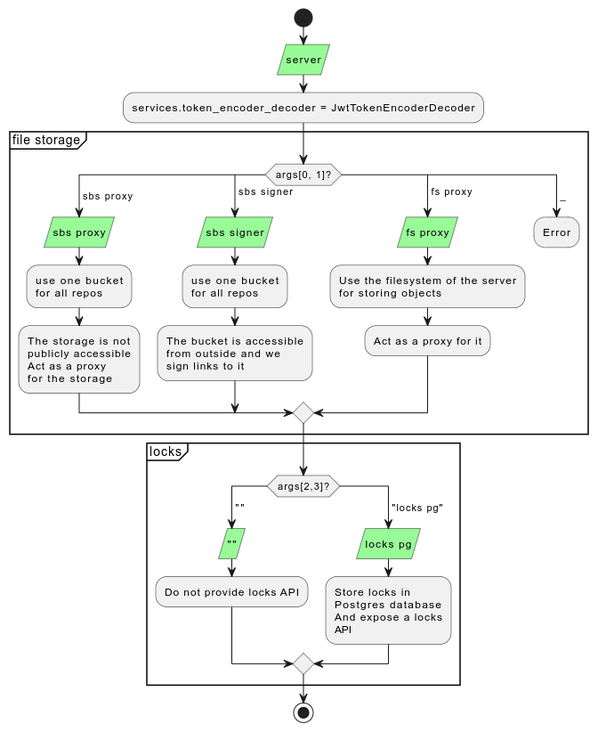

# Configuration of the LFS server

The LFS server comes by default with several variants for the backend storage of the LFS objects, the signing methods and the locks storage. This section will explain how to configure the LFS server to use the desired variant. If none of them suits your needs, or if you want to select and optimize a specific variant, you can refer to the [customization guide](customization-guide.md).

## The variants

The LFS server is run with `server <file storage backend> <proxy mode> (<locks> <locks storage backend>)?`. The following diagram shows the different variants:



For instance, `server sbs signer locks pg` assume there is a single S3 bucket storage backend publically accessible, the server will sign links to upload or download objects to and from it. It will provide the locks API storing them into a Postgres database.

On the other hand, when using directly the filesystem as a storage backend, there is no other component that can be used to check access but the LFS server itself. In this case, the server will always act as a proxy and only `server fs proxy` is available for the file storage variants. The locks API is available independently of the storage backend, and can be used with `server fs proxy locks <locks storage backend>`.

## Run in docker

In docker, the `server` is already in the entrypoint. You just need to provide the command (the 2-4 arguments). For instance: 

```yaml
services:
  lfs: 
    image: gaalafis/lfs-server:x.y.z
    command: ["signer", "sbs"]
    environment:
      ...
    depends_on:
      - ...
    secrets:
      - ...
```

## Configuration

According to the variant chosen, the configuration will be different. The following sections will explain how to configure each variant.

### SBS

When using a single S3 bucket storage backend, the following environment variables are required:

- `SBS_BUCKET_NAME`
- `SBS_ACCESS_KEY_FILE`
- `SBS_SECRET_KEY_FILE`
- `SBS_REGION`
- `SBS_HOST`

### SBS signer

When using a single S3 bucket storage backend with the signer mode, you might want a different host and region for the direct access from the lfs server and from the client. That's the case when the bucket is in the same network as the lfs server, but not as the client. In this case, the client need the public endpoint of the bucket, while the lfs server can use the private endpoint. The following environment variables can be use to configure this behavior:

- `SBS_REGION` and `SBS_HOST` are used to configure the endpoint used by the lfs server (private)
- `SBS_PUBLIC_REGION` and `SBS_PUBLIC_HOST` are used to configure the endpoint used by the client (public). They override `SBS_REGION` and `SBS_HOST` if both are set.

### FS

When using the filesystem as a storage backend, the following environment variables are required:

- `FS_ROOT`: the path in the filesystem where the LFS objects will be stored

### Proxy

Any variant running in proxy mode requires the following environment variables:

- `CUSTOM_SIGNER_HOST`: the host of the LFS server: the links will point to this host
- `CUSTOM_SIGNER_SECRET_FILE`: a file containing the secret used to sign the links
- `CUSTOM_SIGNER_EXPIRES_IN`: the duration of the signed links in seconds

### Token encoder decoder

To authenticate and authorize the users, the LFS server uses JWT tokens. The following environment variables are required to encode and decode the tokens:

- `JWT_SECRET_FILE`: a file containing the secret used to sign the links
- `JWT_EXPIRES_IN`: the duration of the signed links in seconds

### Postgres locks configuration

When using Postgres as a locks storage backend, the following environment variables are required:

- `DATABASE_HOST`
- `DATABASE_NAME`
- `DATABASE_PASSWORD`
- `DATABASE_PASSWORD_FILE`
